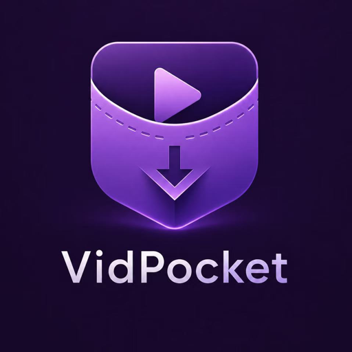

# VidPocket（视频口袋）



**Chrome 网页视频下载工具，面向可直接访问的媒体资源和未加密 HLS 流。**

VidPocket 是一个本地优先的 Chrome 扩展，用来识别网页中浏览器可以直接访问的媒体资源，并把可保存的视频、音频或未加密 HLS 流下载到本地。

它适合个人归档、调试网页媒体、研究网页资源加载、整理自己有权访问的媒体内容。它不是 DRM 绕过工具，也不会尝试破解加密流、登录限制、平台保护或 YouTube 等受保护媒体。

## 功能

- 从页面 DOM 和网络响应中识别媒体资源。
- 支持常见直链媒体：MP4、WebM、MOV、M4V、MP3、M4A、AAC、OGG、WAV、FLAC 等。
- 支持未加密 HLS `.m3u8`，通过本地 FFmpeg helper 转成 MP4。
- HLS 生成完成后再交给 Chrome 下载 API，因此浏览器下载栏里会出现正常下载任务。
- 显示来源、格式、分辨率、时长、封面状态、进度、速度和停止按钮。
- 过滤明显的媒体分片、初始化片段和过小的伪媒体文件，减少下载出坏文件的概率。
- 对 `blob:`、`data:`、加密 HLS、DASH `.mpd`、播放器内部片段等不支持内容，不伪装成可下载视频。

## 搜索关键词

这个项目可以覆盖的关键词包括：网页视频下载、页面视频下载、网页视频保存、Chrome 视频下载、浏览器视频下载、m3u8 下载、HLS 下载、网页媒体识别、视频下载扩展、Chrome video downloader、webpage video downloader、HLS downloader、m3u8 downloader。

建议 GitHub 仓库名：`vidpocket-page-video-downloader`

建议 GitHub 描述：`Chrome webpage video downloader for directly accessible media and unencrypted HLS streams.`

建议 topics：`chrome-extension`, `chrome-video-downloader`, `web-video-downloader`, `webpage-video-downloader`, `page-video-downloader`, `video-downloader`, `hls-downloader`, `m3u8-downloader`, `ffmpeg`, `manifest-v3`

品牌信息：

- 英文名：`VidPocket`
- 中文名：`视频口袋`
- 标语：`把网页中可直接访问的视频装进口袋，保存为本地 MP4。`

## 使用边界

VidPocket 只处理浏览器已经能直接访问的媒体资源。它不会绕过访问控制。

默认不支持：

- DRM 保护视频
- 加密 HLS
- YouTube 和受保护平台媒体
- 未授权的登录/付费内容
- 没有暴露真实媒体地址的 `blob:` 视频
- DASH `.mpd`

请只在你有权访问和保存媒体的场景使用。

## 环境要求

- Google Chrome 或 Chromium 系浏览器
- macOS（当前附带的 helper 安装脚本使用 LaunchAgent）
- Node.js 18 或更新版本
- FFmpeg 和 FFprobe

安装 FFmpeg：

```sh
brew install ffmpeg
```

## 安装

完整安装和使用说明见 [INSTALL.zh-CN.md](INSTALL.zh-CN.md)。英文版见 [INSTALL.md](INSTALL.md)。

1. 打开 `chrome://extensions`
2. 打开右上角 `Developer mode`
3. 点击 `Load unpacked`
4. 选择项目文件夹
5. 安装本地 helper：

```sh
./helper/install-helper.command
```

helper 健康检查：

```sh
curl http://127.0.0.1:17384/health
```

## 使用

1. 打开包含媒体的网页。
2. 如果页面需要播放后才加载真实流地址，先点击播放。
3. 点击浏览器工具栏里的 VidPocket 图标。
4. 查看识别出的媒体条目。
5. 点击 `Download`。

如果是 HLS，扩展会先让本地 helper 生成 MP4，完成后再调用 Chrome 下载。

## 本地 helper

helper 是运行在本机的 HTTP 服务，负责 Chrome 扩展不适合直接完成的工作：

- 读取未加密 HLS playlist
- 从 HLS 抽取封面
- 尽量合并分离的音频/视频 HLS rendition
- 使用 FFmpeg 生成 MP4
- 向弹窗回传进度和速度

macOS 安装后路径：

```text
~/Library/LaunchAgents/com.vidpocket.helper.plist
```

工作目录：

```text
~/Library/Application Support/VidPocket
```

## 开发

运行检查和测试：

```sh
npm test
```

单独运行：

```sh
node --check src/background.js
node --check src/content.js
node --check src/popup.js
node --check helper/vidpocket-helper.mjs
node tests/background-unit.mjs
node tests/popup-match-unit.mjs
node tests/hls-unit.mjs
```

## 隐私

VidPocket 在本地运行。扩展只读取当前标签页中暴露的媒体 URL，并把 HLS 处理请求发送到本机 `127.0.0.1` helper。项目不包含统计、遥测或远程后端。

## 许可证

MIT License。详见 [LICENSE](LICENSE)。
